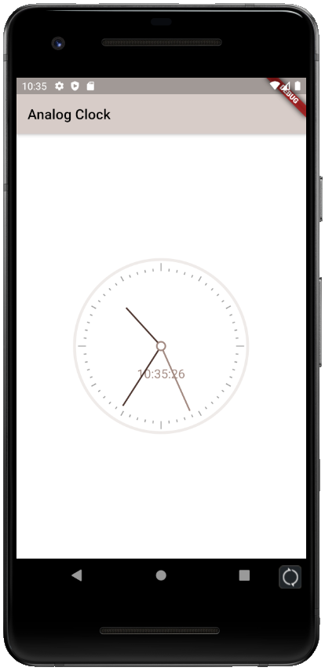

# Analog_lock

아날로그 시계 어플

## Framework

- [Flutter](https://flutter.dev/)

## Language

- [Dart](https://dart.dev/)

## Pacakge

- [Analog_clock 0.0.4](https://pub.dev/packages/analog_clock)

## Preview

## 기능

현재 시간을 알려주는 아날로그 시계
